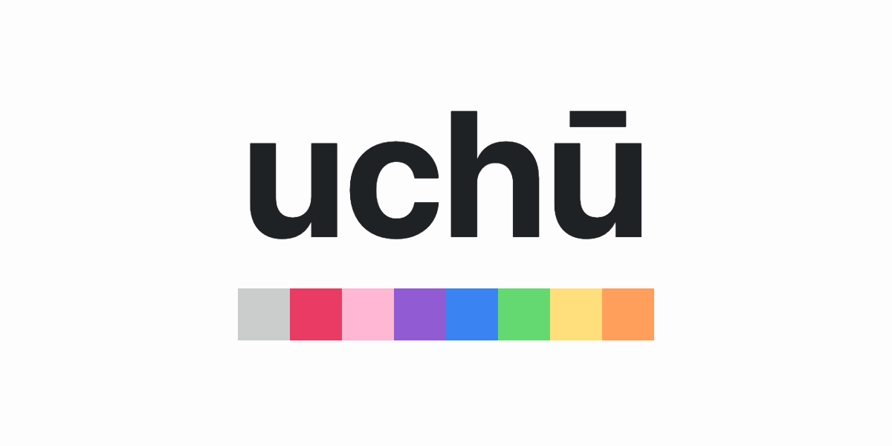

# Overview

**uchū is the color palette for internet lovers, by [NetOperator Wibby](https://webb.page).** uchū utilizes the OKLCH color space [for reasons](https://evilmartians.com/chronicles/oklch-in-css-why-quit-rgb-hsl). I've been using this color palette for personal projects for about a year and have been quite pleased with it.

No, [I will not add other color spaces](./documentation/FAQ.md#normal-colors).

## Table of Contents

- [Expanded Palette](./documentation/EXPANDED.md)
  - [Gray](./documentation/EXPANDED.md#gray)
  - [Red](./documentation/EXPANDED.md#red)
  - [Pink](./documentation/EXPANDED.md#pink)
  - [Purple](./documentation/EXPANDED.md#purple)
  - [Blue](./documentation/EXPANDED.md#blue)
  - [Green](./documentation/EXPANDED.md#green)
  - [Yellow](./documentation/EXPANDED.md#yellow)
  - [Orange](./documentation/EXPANDED.md#orange)
  - [General](./documentation/EXPANDED.md#general)
  - [Sass](./documentation/EXPANDED.md#sass)
- [Reduced Palette](./documentation/REDUCED.md)
  - [Gray](./documentation/REDUCED.md#gray)
  - [Red](./documentation/REDUCED.md#red)
  - [Pink](./documentation/REDUCED.md#pink)
  - [Purple](./documentation/REDUCED.md#purple)
  - [Blue](./documentation/REDUCED.md#blue)
  - [Green](./documentation/REDUCED.md#green)
  - [Yellow](./documentation/REDUCED.md#yellow)
  - [Orange](./documentation/REDUCED.md#orange)
  - [General](./documentation/REDUCED.md#general)
  - [Sass](./documentation/REDUCED.md#sass)
- [Usage](./documentation/USAGE.md)
  - [Pure](./documentation/USAGE.md#pure)
  - [Svelte/SvelteKit](./documentation/USAGE.md#svelte-sveltekit)
- [Showcase](./documentation/SHOWCASE.md)
  - [Apps](./documentation/SHOWCASE.md#apps)
  - [Websites](./documentation/SHOWCASE.md#websites)
- [FAQ](./documentation/FAQ.md)
  - [Origin](./documentation/FAQ.md#origin)
  - [Normal colors](./documentation/FAQ.md#normal-colors)
  - [Dark Mode](./documentation/FAQ.md#dark-mode)
  - [The name](./documentation/FAQ.md#the-name)
  - [Virality](./documentation/FAQ.md#virality)
  - [The tagline](./documentation/FAQ.md#the-tagline)
- [Why UNLICENSE?](./documentation/UNLICENSE.md)
