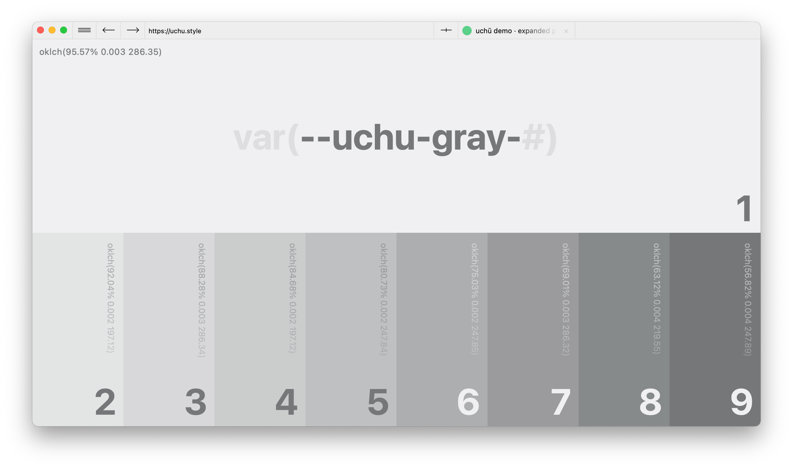
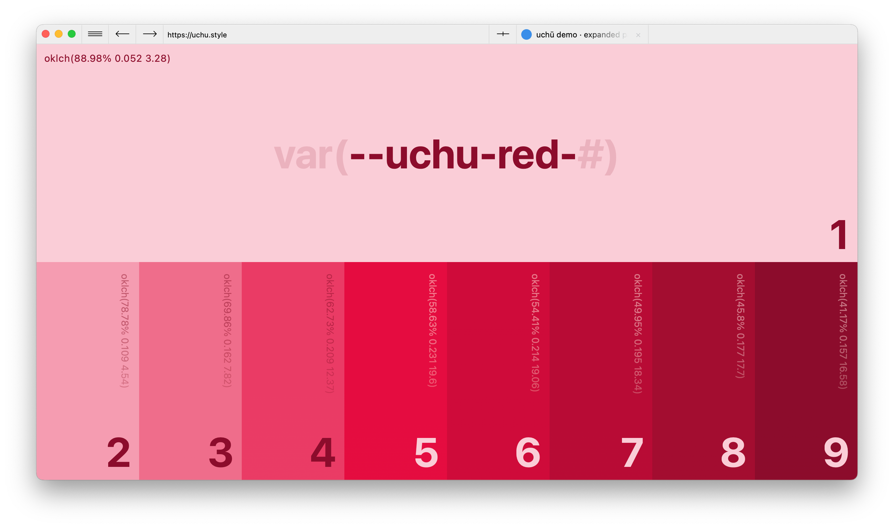
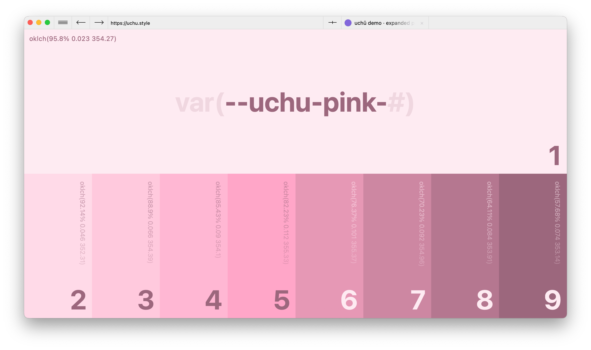
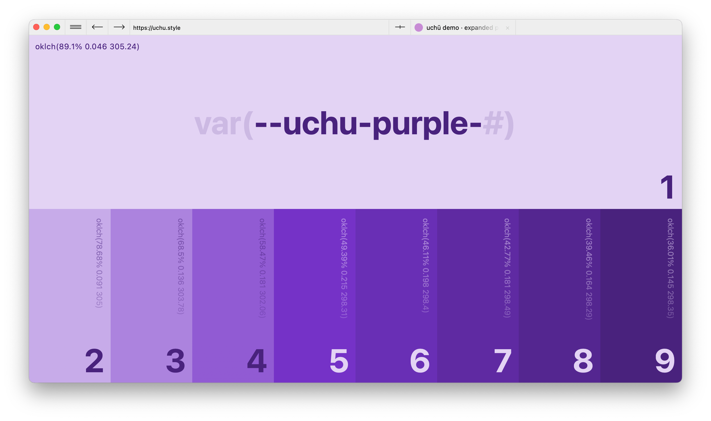
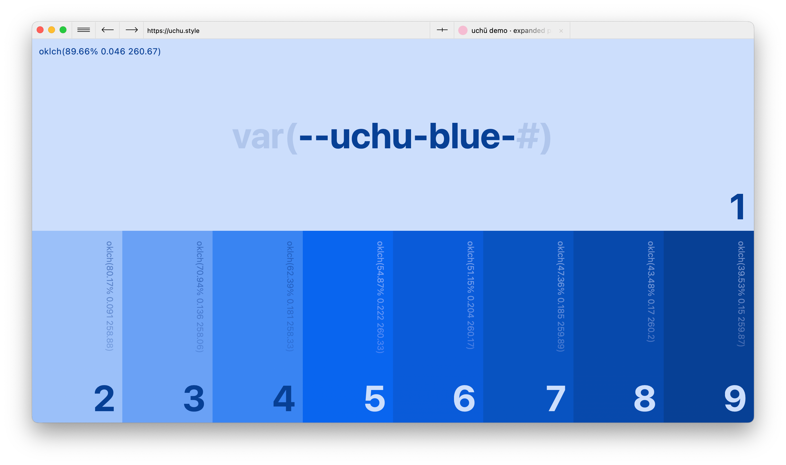
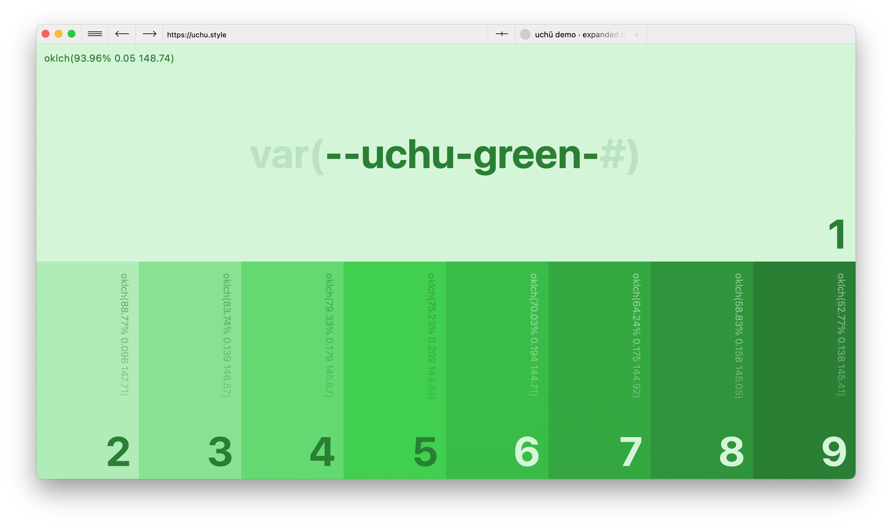
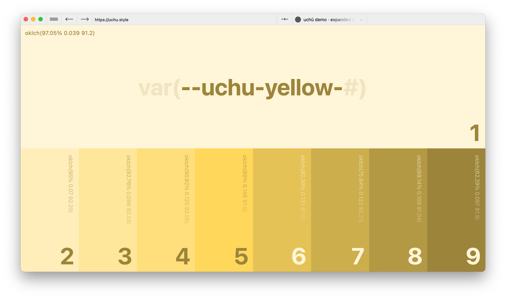
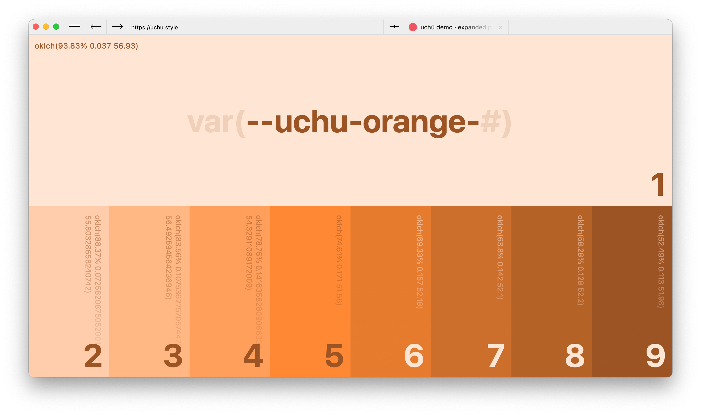
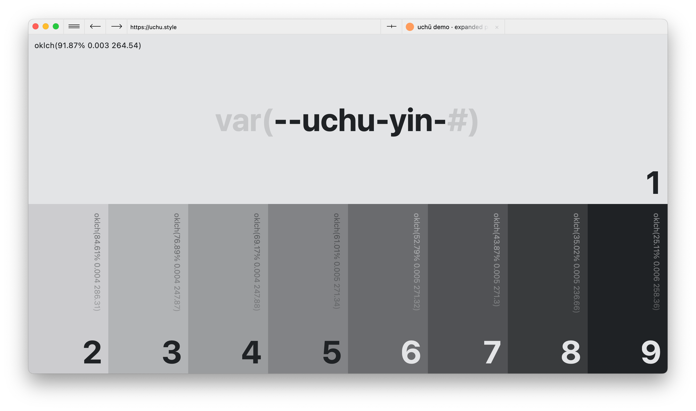

# Expanded Palette

The default color palette is [`css/color_expanded.css`](../css/color_expanded.css) and consists of ten colors, eight of which have nine stops; gray, red, pink, purple, blue, green, yellow, orange. Yin (black) has ten stops while yang (white) only has one stop.

If you want more granularity (read: opacity), you can call the raw version of the color (append `-raw` to the variable name) which will return the OKLCH values so you can do something like this: `oklch(var(--uchu-gray-1-raw) / 40%)`.

## Gray

- `var(--uchu-gray-1)`
- `var(--uchu-gray-2)`
- `var(--uchu-gray-3)`
- `var(--uchu-gray-4)`
- `var(--uchu-gray-5)`
- `var(--uchu-gray-6)`
- `var(--uchu-gray-7)`
- `var(--uchu-gray-8)`
- `var(--uchu-gray-9)`

## Red

- `var(--uchu-red-1)`
- `var(--uchu-red-2)`
- `var(--uchu-red-3)`
- `var(--uchu-red-4)`
- `var(--uchu-red-5)`
- `var(--uchu-red-6)`
- `var(--uchu-red-7)`
- `var(--uchu-red-8)`
- `var(--uchu-red-9)`

## Pink

- `var(--uchu-pink-1)`
- `var(--uchu-pink-2)`
- `var(--uchu-pink-3)`
- `var(--uchu-pink-4)`
- `var(--uchu-pink-5)`
- `var(--uchu-pink-6)`
- `var(--uchu-pink-7)`
- `var(--uchu-pink-8)`
- `var(--uchu-pink-9)`

## Purple

- `var(--uchu-purple-1)`
- `var(--uchu-purple-2)`
- `var(--uchu-purple-3)`
- `var(--uchu-purple-4)`
- `var(--uchu-purple-5)`
- `var(--uchu-purple-6)`
- `var(--uchu-purple-7)`
- `var(--uchu-purple-8)`
- `var(--uchu-purple-9)`

## Blue

- `var(--uchu-blue-1)`
- `var(--uchu-blue-2)`
- `var(--uchu-blue-3)`
- `var(--uchu-blue-4)`
- `var(--uchu-blue-5)`
- `var(--uchu-blue-6)`
- `var(--uchu-blue-7)`
- `var(--uchu-blue-8)`
- `var(--uchu-blue-9)`

## Green

- `var(--uchu-green-1)`
- `var(--uchu-green-2)`
- `var(--uchu-green-3)`
- `var(--uchu-green-4)`
- `var(--uchu-green-5)`
- `var(--uchu-green-6)`
- `var(--uchu-green-7)`
- `var(--uchu-green-8)`
- `var(--uchu-green-9)`

## Yellow

- `var(--uchu-yellow-1)`
- `var(--uchu-yellow-2)`
- `var(--uchu-yellow-3)`
- `var(--uchu-yellow-4)`
- `var(--uchu-yellow-5)`
- `var(--uchu-yellow-6)`
- `var(--uchu-yellow-7)`
- `var(--uchu-yellow-8)`
- `var(--uchu-yellow-9)`

## Orange

- `var(--uchu-orange-1)`
- `var(--uchu-orange-2)`
- `var(--uchu-orange-3)`
- `var(--uchu-orange-4)`
- `var(--uchu-orange-5)`
- `var(--uchu-orange-6)`
- `var(--uchu-orange-7)`
- `var(--uchu-orange-8)`
- `var(--uchu-orange-9)`

## General

- `var(--uchu-yin-1)`
- `var(--uchu-yin-2)`
- `var(--uchu-yin-3)`
- `var(--uchu-yin-4)`
- `var(--uchu-yin-5)`
- `var(--uchu-yin-6)`
- `var(--uchu-yin-7)`
- `var(--uchu-yin-8)`
- `var(--uchu-yin-9)`
- `var(--uchu-yin)`
- `var(--uchu-yang)`

## Sass

If you know what Sass is, you'll know how to use [`sass/color_expanded.scss`](../sass/color_expanded.scss). I didn't provide raw versions of them because Sass comes with so many color tools (and, I've been using regular CSS variables in my Sass _anyways_).
