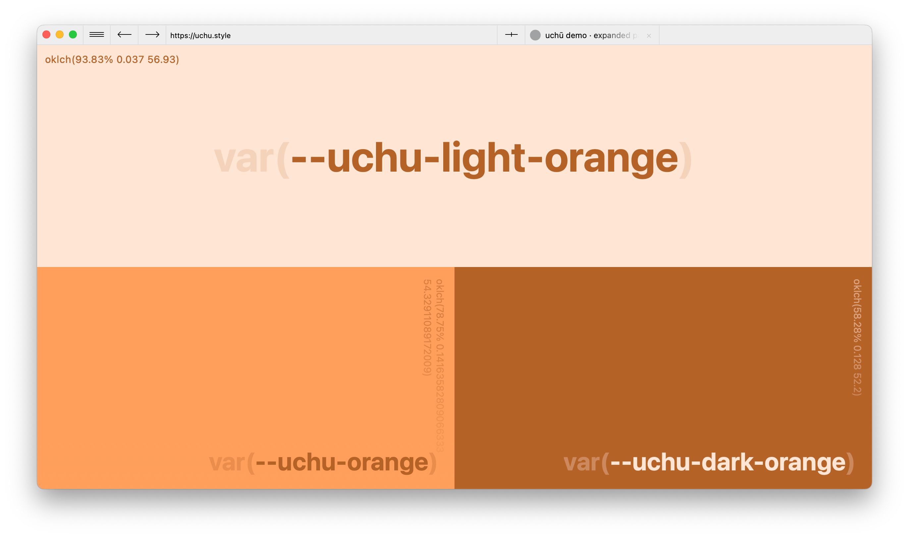

# Reduced Palette

Sometimes, an abundance of color options is a hindrance. Analysis paralysis, amirite? To this end [`css/color.css`](../css/color.css) reduces the number of stops in the expanded palette to three, save for yin (it only has two) and yang (it only has one).

If you want more granularity (read: opacity), you can call the raw version of the color (append `-raw` to the variable name) which will return the OKLCH values so you can do something like this: `oklch(var(--uchu-light-gray-raw) / 40%)`.

## Gray

- `var(--uchu-light-gray)`
- `var(--uchu-gray)`
- `var(--uchu-dark-gray)`

## Red

- `var(--uchu-light-red)`
- `var(--uchu-red)`
- `var(--uchu-dark-red)`

## Pink

- `var(--uchu-light-pink)`
- `var(--uchu-pink)`
- `var(--uchu-dark-pink)`

## Purple

- `var(--uchu-light-purple)`
- `var(--uchu-purple)`
- `var(--uchu-dark-purple)`

## Blue

- `var(--uchu-light-blue)`
- `var(--uchu-blue)`
- `var(--uchu-dark-blue)`

## Green

- `var(--uchu-light-green)`
- `var(--uchu-green)`
- `var(--uchu-dark-green)`

## Yellow

- `var(--uchu-light-yellow)`
- `var(--uchu-yellow)`
- `var(--uchu-dark-yellow)`

## Orange

- `var(--uchu-light-orange)`
- `var(--uchu-orange)`
- `var(--uchu-dark-orange)`

## General

- `var(--uchu-light-yin)`
- `var(--uchu-yin)`
- `var(--uchu-yang)`

## Sass

If you know what Sass is, you'll know how to use [`sass/color.scss`](../sass/color.scss). I didn't provide raw versions of them because Sass comes with so many color tools (and, I've been using regular CSS variables in my Sass _anyways_).
